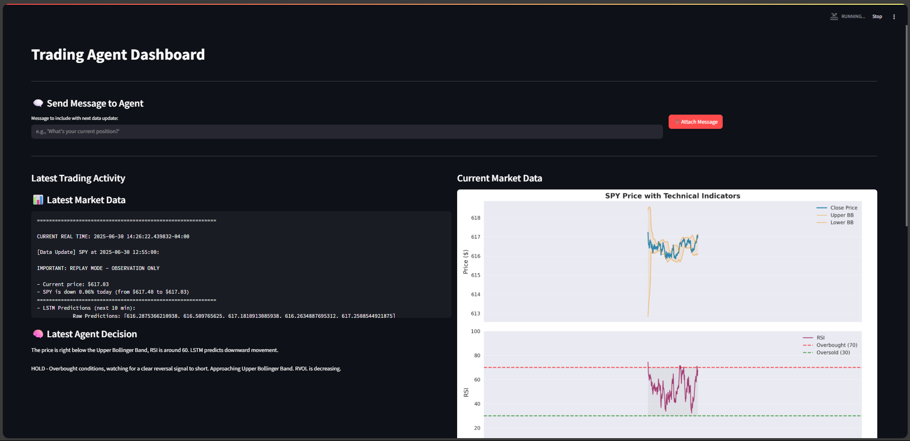

# autoTrader-lite
This is an AI powered single-stock focused Decision Agent using an LSTM neural network for SPY analysis and automated decision making.

# VISIT THE LIVE DEMO: 
[autotrader-lite.adammontano.net](http://autotrader-lite.adammontano.net)

## Available during NYSE Market Hours
Monday - Friday 
9:30 am ET - 4:30 pm ET


Using AWS lambda functions and systemd service, the live demo is scheduled to start and stop aligned with market hours to optimize the costs of operation.

# Overview
This is an automated Google Gemini powered trading system. It uses Langchain libraries to access the Gemini 2.0 Flash model which is specifically purposed for agentic tasks. It has a custom system prompt instructing the AI how to behave, manage risk, and execute trades. The market data feed comes from Alpaca, through the Alpaca-py sdk. Using the Alpaca-py sdk, and Alpaca API credentials, the Decision Agent has access to make buy and sell orders.

If you're curious to learn more about agentic AI, I recommend viewing Day 3 of the 5-Day Gen AI Intensive Course with Google on Kaggle: https://www.kaggle.com/learn-guide/5-day-genai, read the "Generative AI Agents" and "Agents Companion" whitepapers.


## Features:
* Seamless transition between historical and real-time SPY analysis
* Price predictions using LSTM neural networks
* Automated trade execution via Alpaca API
* Containerization with docker-compose
* Live dashboard with Streamlit
* Langchain agent architecture
* market scheduler module to gracefully handle starting/stopping the AI trading environment.


# Architecture:

## Langchain Agents
* For a typical AI agent that chats with users and uses tools, its langgraph connections would look like:
  * AI <-> Human + AI <-> Tools
  * Where the AI can communicate with both the Human user, and make tools calls and interpret a tool's output.
* For this project, the Decision Agent's langgraph connections look like:
  * AI <-> Data + AI <-> Tools
  * The human has been replaced with the data feed and there is no human input, aside from the occasional message injection. 
  * The data updates on intervals, automating the message function that human users would use to message the AI.

Visit the langchain documentation: https://python.langchain.com/docs/introduction/

## LSTM Neural Network
* The LSTM is trained with the following architecture:
  * Single LSTM Layer, 50 units
  * Dense Layer, 128 units
  * Second Dense layer, 5 units
  * Resulting in Linear output
* Input Features:
  * OHLC Prices
  * Volume
  * VWAP
  * RSI
  * MACD
  * Bollinger Bands
* Trained with 80/20 train/test split with early stopping
* Predictions:
  * Uses 20 previous candles to predict the next 5.
  * Inverse transformed predictions for direct price prediction.

## Data Architecture

* SQLite Database:
  * Retains historical data, technical indicators, LSTM model versions
* Real-time Live Data Feed:
  * Provided by Alpaca IEX market data in 1 minute intervals
* Persistent Storage:
  * autotrader_lite.db
  * live_trades.json
  * live_trading.log
  * simulation_logs/
* The json and log files are used to record decisions, trades, and performance.

## AI Trading Plan
* Reviews system instructions in `decision_utils.py`
* Three alternative system instruction sets for different trading strategies
  * Currently uses aggressive trading system instruction (`AGGRESSIVE_GEMINI_TRADER_SYSINT`)
* Risks between 10-25% of account per trade
* Exits trades when at least +0.25% profit or -0.15% loss
* Max 8 trades per day
* Daily loss limit of -2% of the account per day.
* Entry Criteria:
  * Momentum Breakout: price up at least 0.15% in three candles and RVOL greater than 1.2.
  * Bollinger Bounce: price touches lower bollinger band, and RSI < 40.
  * LSTM Price Alignment: LSTM predicts upward movement, and price is rising.
  * Reverse Scalp: price drops more than 0.2 percent, buy after first green candle.

# API KEYS, CRITICAL INFO:

## Rate limiting
* The gemini api has a free tier to use their models with a 200 requests per day (RPD) limit and 15 requests per minute (RPM) limit. 
* If this project were to be run as a demonstration, modify the following varibles in historical_data_simulator.py:
  * The `interval_seconds` variable will need to be at least 4 seconds to avoid the RPM limit. 
  * The `max_iterations` variable will need to be set to at most 200 to avoid the RPD limit. 

If this trading system were to be used consistently/extended periods, you will need an API key from google cloud console, and enabled billing for higher rate limits. If running without an API key, ensure that the API key being passed into the LLM invocation is commented out.

Visit the google gemini API documentation: https://ai.google.dev/gemini-api/docs?authuser=1

## Alpaca Py API key required
In order to access Alpaca's API endpoints, an API key and secret is required. Make sure the API credentials are for a paper trading account, API credentials for a market account requires real money from personal funds.

View this tutorial for setting up an Alpaca account and obtaining paper trading API credentials: https://alpaca.markets/learn/connect-to-alpaca-api
Visit the Alpaca website to obtain API credentials: https://app.alpaca.markets/signup?ref=alpaca.markets
Visit the Alpaca-py documentation: https://alpaca.markets/sdks/python/

# Quick Start:
Within a python environment:

`pip install -r requirements.txt`

## historical_data_simulator.py
To run the project directly:
`python3 historical_data_simulator.py`
* The main function call begins the historical data in March 1st, 2025, up to today.
* If running for the first time, it can take time to build the database and train the LSTM
* All data feed messages, and AI decisions are printed to the console, so activity aside from visualizations can be monitored without viewing the dashboard directly.

## dashboard.py
If you want to view dashboard.py, in a separate terminal while historical_data_simulator.py runs in the other, within the same project directory, run:
`streamlit run dashboard.py`

Then view the dashboard in your browser on port 8501.

# System Requirements
* Python 3.12+
* 4GB RAM minimum
* Docker & docker-compose (for containerization)
* Active internet connection

# Tech Stack:
Review requirements.in and requirements.txt to view the full list of dependencies.
Main dependencies:
* langchain
* alpaca-py
* tensorflow-cpu
* numpy
* pandas
* SQLite
* streamlit

# .env file configuration:
config.py and alpaca_clients.py set up the APIs used in this project. config.py accesses the API keys through a .env file. 

You will need a .env file with these credentials, the GEMINI API KEY is not needed if you comment out its use in decision_utils.py

## .env
```
ALPACA_API_KEY =
ALPACA_API_SECRET =
GOOGLE_API_KEY =
```

# Docker Deployment
The app can be run as a docker-container.
Ensure Docker and docker-compose are installed on your system. The project already has Dockerfile and docker-compose.yml. In your terminal within the project directory, run:

`docker-compose up --build -d`

This will build and run the docker container. Two applications run:
* `market_scheduler.py` 
* `dashboard.py` 

Both applications are built run using docker-compose so that they share storage. If the docker containers were completely separate then the dashboard cannot access the logs and visualizations created by `historical_data_simulator.py`.

`market_scheduler.py` handles starting and stopping the historical_data_simulator.py module by checking if the stock market is currently open or closed.
View the dashboard on port 8501. 


# Troubleshooting
* LSTM Issues: Delete the `models_saved/` directory, and restart historical_data_simulator.py to retrain the model. 
* API Rate Limiting: Increase interval seconds to 4+ if you encounter 429 errors
* Dashboard Not Updating: Check if dashboard.py and historical_data_simulator are running in the same directory, and reading/writing to the same live_trading.log and current_chunk.csv files. 
* Missing database or SQLite locked: stop all processes, delete `.db`, `.db-wal`, and .db-shm` files to create new database.

# Future work
* Review Agent:
  * A major improvement that I am already working on is a second AI agent that will make use of the logging, creating a feedback loop. It will review the Decision Agent's trades/performance, modify system prompts, and create simulation parameters to test and improve performance.
* LSTM Retraining:
  * The LSTM currently only trains upon using the application for the first time. Retraining modules from a previous LSTM project will be refactored into this project to ensure the model remains current. 
* RVOL Feature:
  * The add indicators function was refactored from a previous LSTM project without RVOL being considered. Currently, the RVOL is calculated inside of the simulation's data update messages inaccessible to the LSTM. RVOL should be calculated in the add_indicators function for consistent data access between the LSTM and the Decision Agent. 
* Database Optimization:
  * Currently the database is using SQLite, PostgreSQL would give better concurrent access and bulk operations.
  * The indicators are recalculated for the entire dataset currently, it should be calculated incrementally/only on gap data for efficiency.
* Dashboard Expansion:
  * The dashboard currently only shows the current update message, visualization, and AI decision. This can be improved to show trade logging, performance metrics, and smoother UX. 
* Monitoring and Alerts:
  * Email notifications for starting/stopping, trade execution, daily summaries, and errors.
